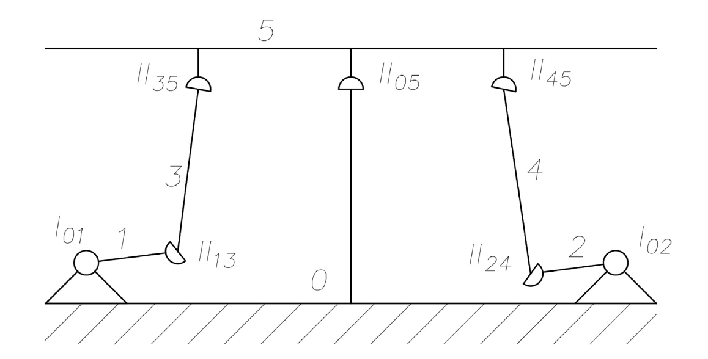
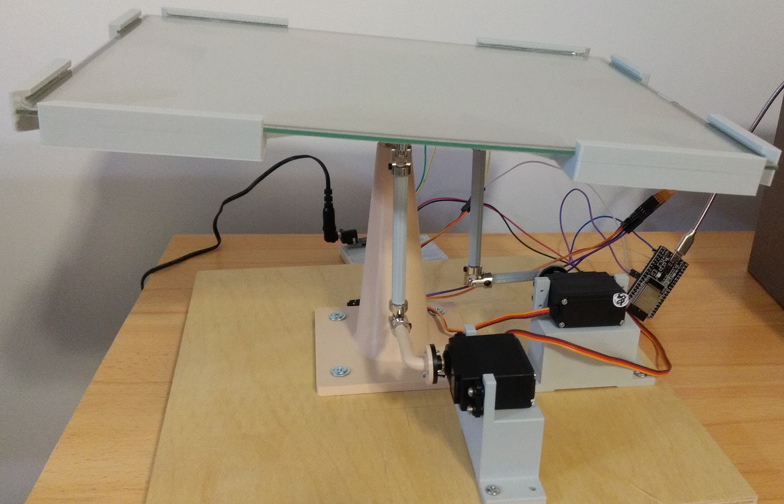

# Ball-on-a-plate control system

Control application for a 2-DoF ball-on-a-plate system

## Problem statement and target system

Ball on a plate is a common control theory problem where the goal is to manipulate the plate's inclination in such a way as to keep the ball from falling off. This software applies to a system which builds on top of this well-known problem by adding Industry 4.0 / IoT aspects and employing a distributed control network of wirelessly connected devices. Namely, it is to be deployed to a 2-DoF ball-on-a-plate system consisting of three ESP32-based devices:
- the *plant* (`plant/`) implementing the feedback loop and PID regulation,
- a handheld *controller* (`controller/`) allowing for dynamically changing the ball's setpoint,
- an operator's PC with an ESP32 *router* connected (`router/`) running a GUI/HMI application (`frontend/`)

The software was designed and implemented with the following kinematics of the platform in mind:

<div align="center"></div>

where the II-pairs are universal (Cardan) joints and the I-pairs are revolute joints (servo shafts), though the software should work with similar 2-DoF configurations as well.

The servos used to manipulate the plate are assumed and hardcoded to work with the typical 50 Hz PWM (see preprocessor definition `BOAP_CONTROL_PWM_FREQUENCY` in `plant/components/boap_control/boap_control.c`). Any mechanical offset in servo rotation can be compensated in software by setting the `BOAP_CONTROL_SERVO_X_AXIS_OFFSET_DEG` and `BOAP_CONTROL_SERVO_Y_AXIS_OFFSET_DEG` variables in `env.cmake`.

The target system uses a 4-wire resistive touchscreen as a ball position sensor (or input sensor in the case of the *controller*). ADC thresholds for the touchscreen(s) can be calibrated using the provided helper application (`tools/touchscreen_tuner/`). These, along with other hardware-specific or deployment-dependent parameters, must be set in the `env.cmake` file (see `env.cmake.example` for reference).

The PID tuning parameters get initialized to all zeroes for both axes (see e.g. `BOAP_CONTROL_PROPORTIONAL_GAIN_DEFAULT` in `plant/components/boap_control/boap_control.c`) and can be changed dynamically via the frontend application.

---

<div align="center">  </div>

---

## Deployment

1. Clone the `https://github.com/espressif/esp-idf` repository (see compatibility notice at the bottom)

```bash
git clone https://github.com/espressif/esp-idf
```

2. Set up the ESP-IDF environment as described here:
   `https://github.com/espressif/esp-idf`

3. Set hardware-specific parameters in file `env.cmake` (see `env.cmake.example` for
   reference)

4. Flash the boards and monitor their startup

```bash
cd plant
idf.py build
idf.py -p <port> flash monitor
cd ../router
idf.py build
idf.py -p <port> flash monitor
cd ../controller
idf.py build
idf.py -p <port> flash monitor
cd ..
```

5. Set up a Python virtual environment and install the front-end application

```bash
python -m venv venv
source venv/bin/activate
pip install -e frontend
```

6. Start the Python GUI application

```bash
python -m boap -p <port>
```

---

## Documentation

Generate source code documentation

```bash
cd doc/
doxygen
```

---

## Compatibility

The project is compatible with `ESP-IDF v5.2`.
